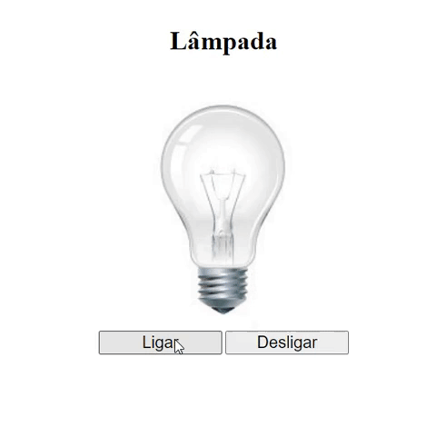

<h1  align="center" >Lâmpada</h1>

<h2>📕 Indice</h2>

<ul>
  <li>Sobre o projeto</li>
  <li>Tecnologias utilizadas</li>
  <li>Preview</li>
</ul>

<h2>💻Sobre o projeto</h2>

Este projeto foi desenvolvido a partir do vídeo, aula do professor Fernando Leonid.

A ideia desse projeto é ligar, desligar, é destruir a lâmpada.

Observação: Peguei as imagens do projeto, o código-fonte desse projeto realizei, sem assistir a vídeo, aula, posteriormente assistir à aula.

Aperte o ícone para ser levado até a aula no YouTube!

&nbsp;&nbsp;&nbsp; 

<h3>🚀 Tecnologias utilizadas</h3>

<ul>
  <li>HTML</li>
  <li>CSS</li>
  <li>JavaScript</li>
</ul>

<h2>🔥 Preview </h2>

Clique no botão para ir até preview do projeto.

