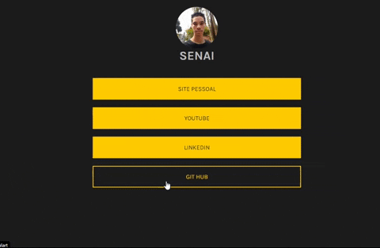

<h1  align="center" >Linktree</h1>

<h2>📕 Indice</h2>

<ul>
  <li>Sobre o projeto</li>
  <li>Tecnologias utilizadas</li>
  <li>Preview</li>
</ul>

<h2>💻Sobre o projeto</h2>

Clone do Linktree que é uma página de destino de referência de mídia social.

O Linktree é uma ferramenta que permite ao usuário divulgar os links de todas as suas redes sociais na bio do Instagram. Ela costuma ser muito utilizada 
por influenciadores digitais para divulgar outras redes e por empresas, que inserem os sites para venda de seus produtos.

&nbsp;&nbsp;&nbsp; 

<h3>🚀 Tecnologias utilizadas</h3>

<ul>
  <li>HTML</li>
  <li>CSS</li>
  <li>JavaScript</li>
</ul>

<h2>🔥 Preview </h2>

Clique no botão para ir até preview do projeto.

