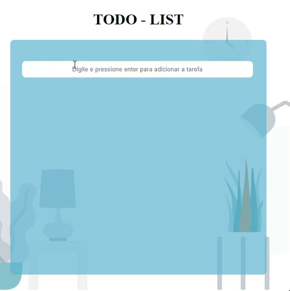
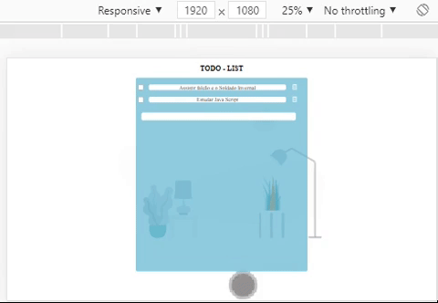
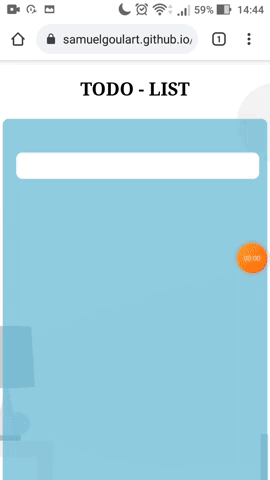

<h2 align="left" >🔥 Preview 
  
 
 

<h1  align="center" >To-Do Lists</h1>

</h2>

<h2>📕 Indice</h2>

<ul>
  <li>Sobre o projeto</li>
  <li>Tecnologias utilizadas</li>
  <li>Preview</li>
</ul>

<h2>💻Sobre o projeto</h2>

To-Do Lists são listas de todas as tarefas que você precisa realizar, ou seja, elas listam tudo que você tem a fazer.

Este mini-projeto foi desenvolvimento durante atividade do curso de Técnico de desenvolvimento de sistemas.

&nbsp;&nbsp;&nbsp; 

<h3>🚀 Tecnologias utilizadas</h3>

<ul>
  <li>HTML</li>
  <li>CSS</li>
  <li>JavaScript</li>
</ul>

<h2>🔥 Preview </h2>

Clique no botão para ir até preview do projeto.

<h3>🖥️ Responsividade </h3>

<h3>📱 Tela do smartfone </h3>

